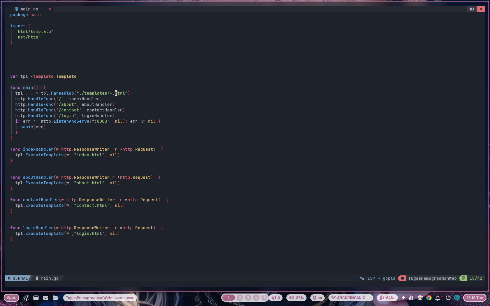
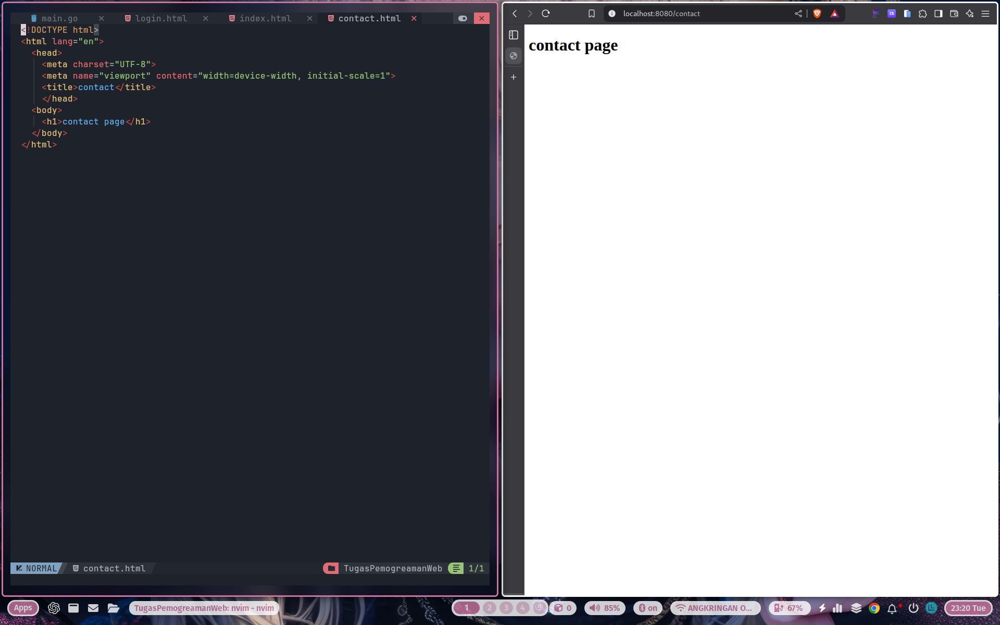

# Tugas Pemrograman Web
## Struktur Proyek
```
TugasPemogramanWeb/
│── templates/
│   ├── index.html
│   ├── about.html
│   ├── contact.html
│   ├── login.html
│── main.go
│── go.mod
│── README.md
```

## Instalasi dan Menjalankan

1. Pastikan Go sudah terinstall di sistem.
2. Clone repository ini:
   ```sh
   git clone git@github.com:nabilulilalbab/assigmentpeomgramanweb2.git
   ```
3. Masuk ke direktori proyek:
   ```sh
   cd assigmentpeomgramanweb2
   ```
4. Jalankan server:
   ```sh
   go run main.go
   ```
5. Akses aplikasi di browser dengan membuka `http://localhost:8080`

## Screenshot
Berikut beberapa tampilan dari aplikasi:







## Rute (Endpoints)
| Endpoint  | Deskripsi |
|-----------|-----------|
| `/`       | Halaman utama |
| `/about`  | Halaman tentang |
| `/contact`| Halaman kontak |
| `/login`  | Halaman login |

## Teknologi yang Digunakan
- Golang
- HTML

## Lisensi
Proyek ini dibuat untuk keperluan pembelajaran dan bebas digunakan serta dimodifikasi.


